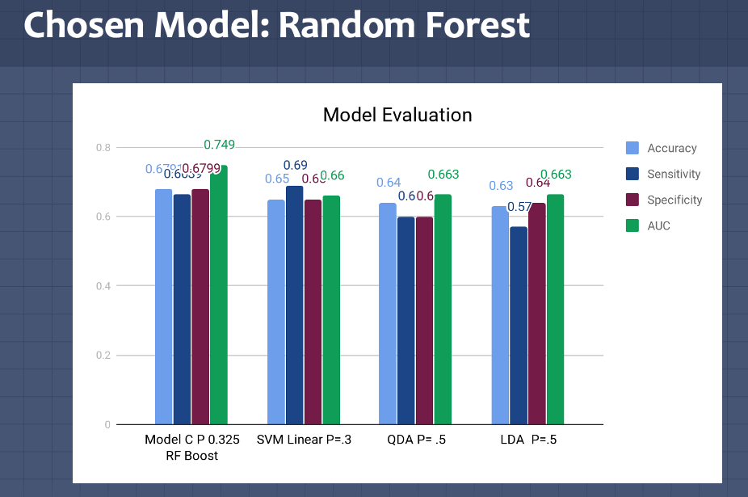

# WestCustomerChurnPrediction
This project merge and clean data (with outliers removed),  then QDA, Random Forest, SVM, and SVC are used to predict if the patients are likely to stop doing business with the West Corporate.  The parameters are adjusted, and the result is compared to find the best model for the selected data. 

